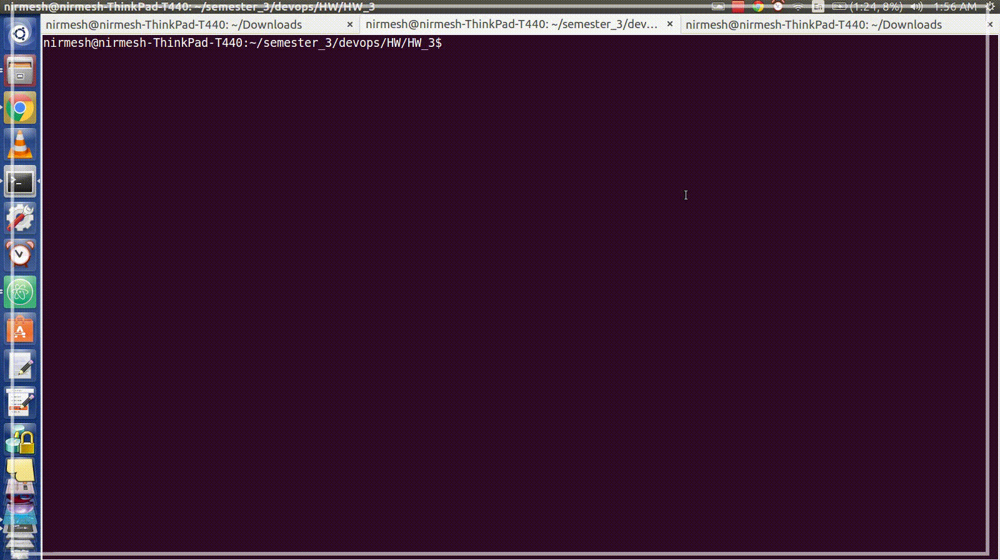
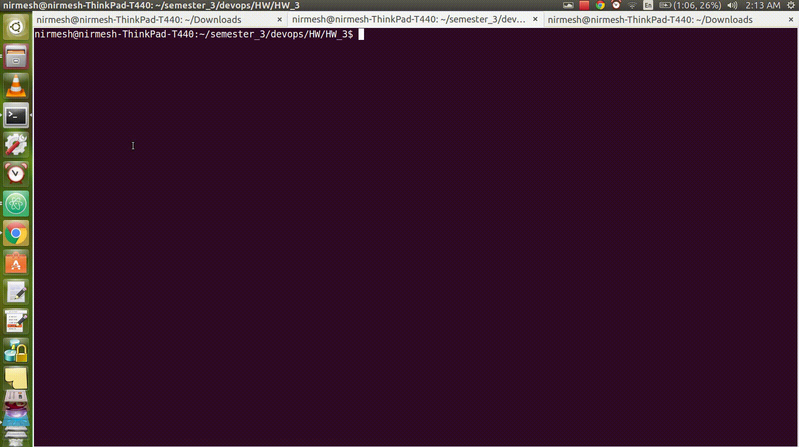
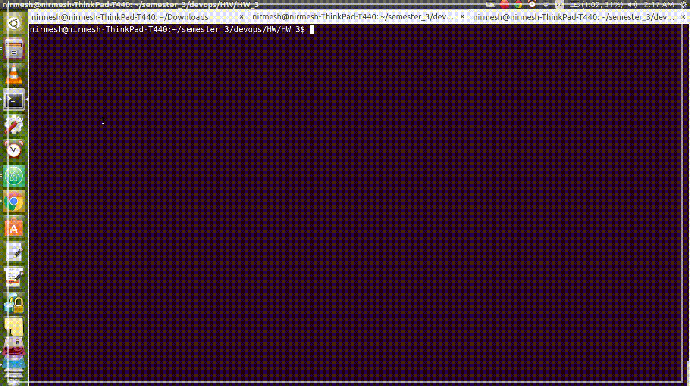

Cache, Proxies, Queues
=========================

### Get, Set and Recent
- 

### Image upload
- 

### Proxy server
- Start 3 different servers on port 3000, 3001 and 3002. The main.js accepts port number as command line argument
```bash
node main.js 3000
node main.js 3001
node main.js 3002
```
- Start proxy server on port 80: `sudo node proxy.js`. Note: sudo access required to start server on port 80.
- Hit multiple urls on `http://localhost/`. The proxy will redirect them evenly on 3000, 3001 and 3002 instances. This is implemented using circular list in redis `RPOPLPUSH`.
- 


### Setup

* Clone this repo, run `npm install`.
* Install redis and run on localhost:6379
