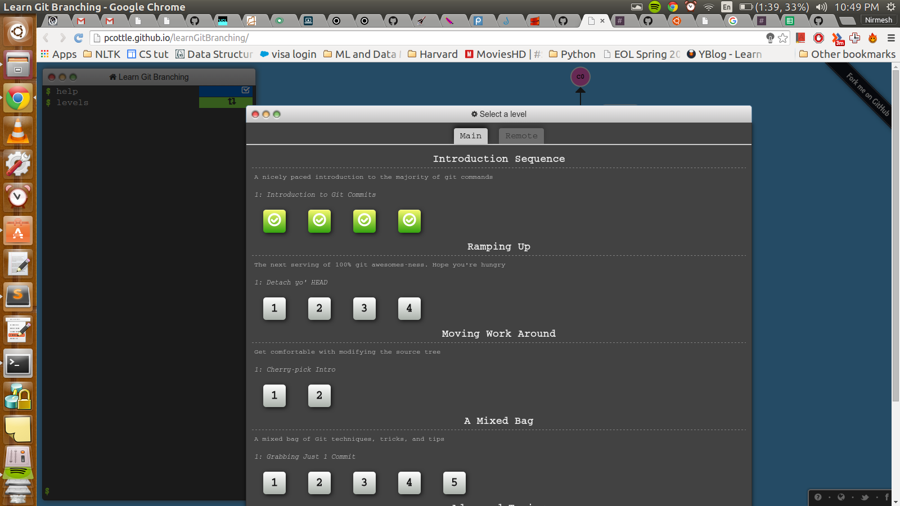
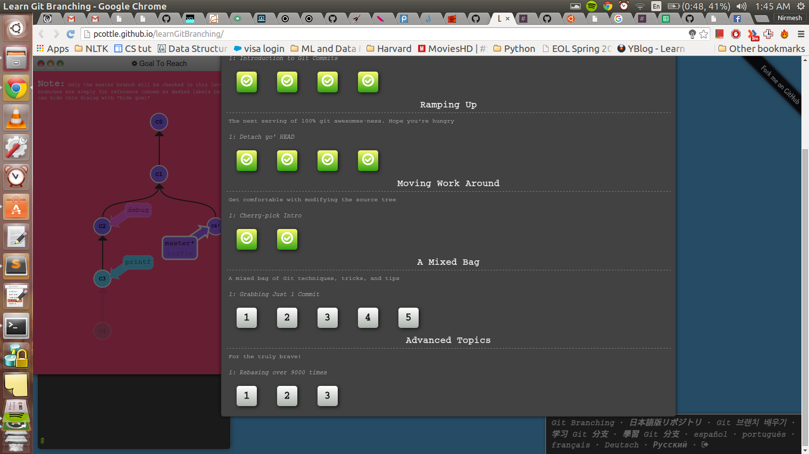

# First 4 levels
## Introduction to git commits

### Level 1
* `git commit -m "First commit"`
* `git commit -m "Second commit"`

### Level 2
* `git checkout -b bugFix`

### Level 3
* `git checkout -b bugFix`
* `git commit -m "Commit on BugFix"`
* `git checkout master`
* `git commit -m "commit on master"`
* `git merge bugFix`

### Level 4
* `git checkout -b bugFix`
* `git commit -m "Commit on BugFix"`
* `git checkout master`
* `git commit -m "commit on master"`
* `git checkout bugFix`
* `git rebase master`

### ScreenShot


# Bonus levels
## Detach yo' Head

### Level 1
* `git checkout bugFix`
* `git checkout C4`

### Level 2
* `git checkout bugFix^`

### Level 3
* `git checkout HEAD^`
* `git branch -f bugFix HEAD^`
* `git checkout C6`
* `git branch -f master HEAD`
* `git checkout HEAD~3`

### Level 4
* `git reset HEAD~1`
* `git checkout pushed`
* `git revert HEAD`

## Cherry-pick Intro
* `git cherry-pick C3 C4 C7`
* `git rebase -i HEAD~4 --aboveAll`

## Bonus screen shot



# Git hooks

### Hook script content
```python
#!/usr/bin/env python

import webbrowser

# open a public URL, in this case, the webbrowser docs
url = "https://nodejs.org/en/"
webbrowser.open(url,new=1)
```
### Demo Screencast
[Demo](https://vid.me/HLW0)